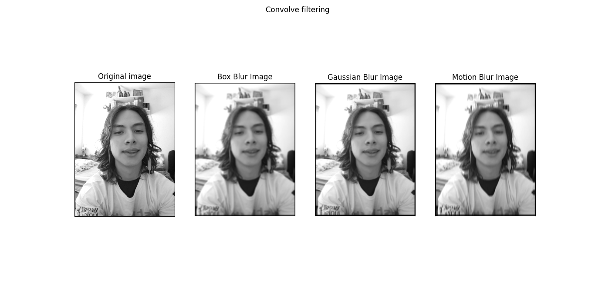
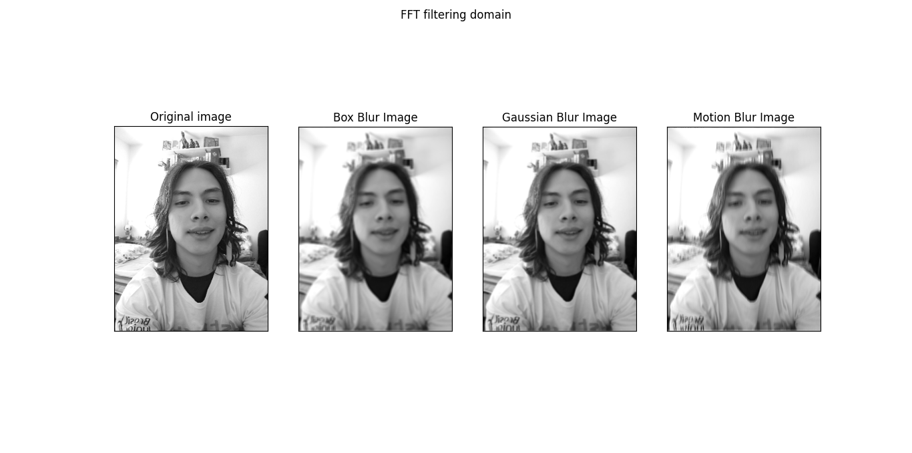
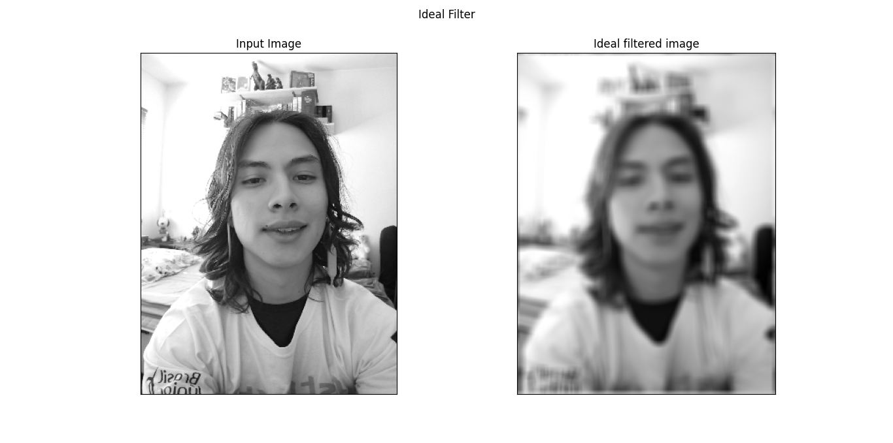
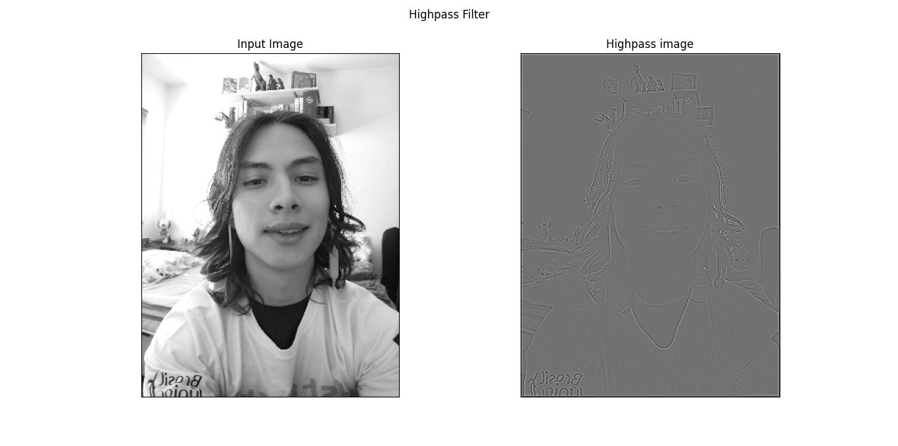
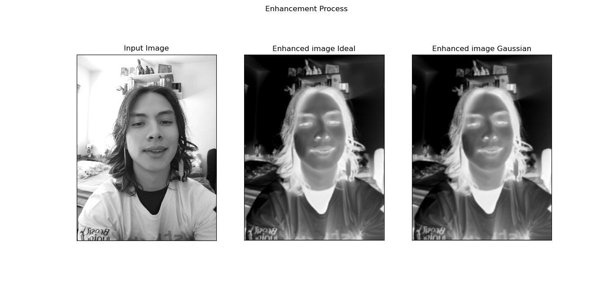
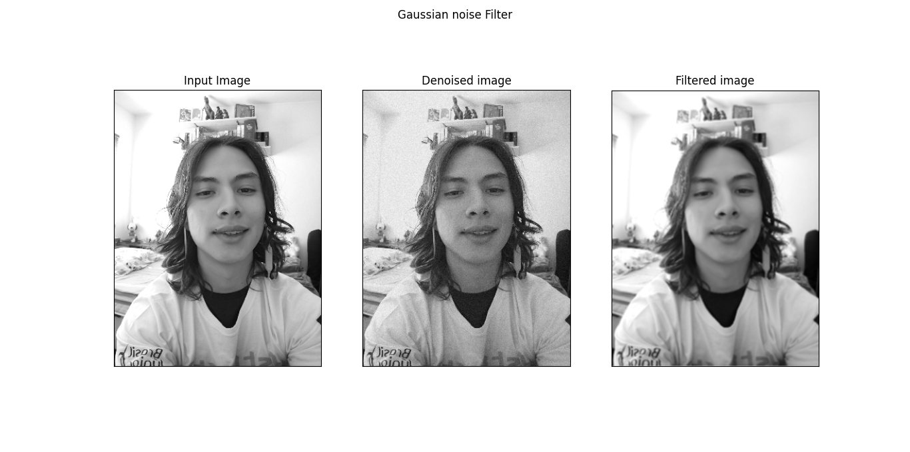
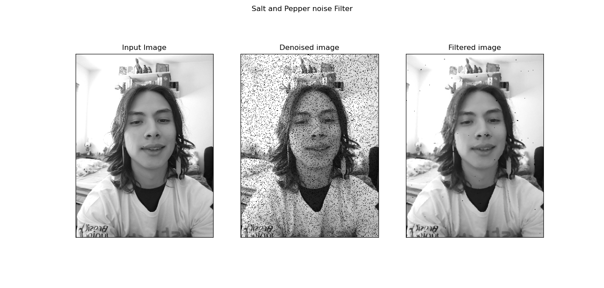

# Projeto 2 - Processamento de sinais multimídia

## **Otho Teixeira Komatsu - 170020142**

## Aspectos técnicos

O código desse trabalho foi desenvolvido em `Python 3.8.3`, utilizando o 
ambiente virtual `virtualenv` para a instalação dos pacotes. As libs principais 
utilizadas foram o `openCV2`(manipulação de imagem), 
`numpy`(manipulação de matriz), e `matplot`(plot de gráficos);

## Devenvolvimento

Para a realização das atividades do projeto, foi primeiro convertido a imagem 
do formato RGB para `grayscale uint8` utilizando a relação 
$Y = 0.30 R + 0.55 G + 0.15 B$ e um _rescale_ para (300,400).

Com a imagem em escala de cinza, é obtido seu espectro em frequência.

### 1. Borrar com convolução

Para o processo de borragem por convolução, foram utilizados 3 kernels diferentes: 
_blur box_, o gaussiano, e o _motion blur_(horizontal), de tamanhos, respectivamente, 
5,5,7. Para esse processo, também foi adicionado padding na imagem original.

Para o _blur box_:

$$
\begin{bmatrix}
\frac{1}{9} & \frac{1}{9} & \frac{1}{9} & \frac{1}{9} & \frac{1}{9}\\
\frac{1}{9} & \frac{1}{9} & \frac{1}{9}& \frac{1}{9} & \frac{1}{9}\\
\frac{1}{9} & \frac{1}{9} & \frac{1}{9}& \frac{1}{9} & \frac{1}{9}\\
\frac{1}{9} & \frac{1}{9} & \frac{1}{9}& \frac{1}{9} & \frac{1}{9}\\
\frac{1}{9} & \frac{1}{9} & \frac{1}{9}& \frac{1}{9} & \frac{1}{9}
\end{bmatrix}$$

Para o gaussiano:
$$
\begin{bmatrix}
\frac{1}{273}&\frac{4}{273}&\frac{7}{273}&\frac{4}{273}&\frac{2}{273}\\
\frac{4}{273}&\frac{16}{273}&\frac{26}{273}&\frac{16}{273}&\frac{4}{273}\\
\frac{7}{273}&\frac{26}{273}&\frac{41}{273}&\frac{26}{273}&\frac{7}{273}\\
\frac{4}{273}&\frac{16}{273}&\frac{26}{273}&\frac{16}{273}&\frac{4}{273}\\
\frac{1}{273}&\frac{4}{273}&\frac{7}{273}&\frac{4}{273}&\frac{1}{273}\\
\end{bmatrix}$$

E para o _motion blur_:

$$
\begin{bmatrix}
0 & 0 & 1 & 0 & 0\\
0 & 0 & 1& 0 & 0\\
0 & 0 & 1& 0 & 0\\
0 & 0 & 1& 0 & 0\\
0 & 0 & 1& 0 & 0
\end{bmatrix}$$

### 2. Borrar com FFT
Para o processo de borragem por FFT, foi utilizado o espectro da imagem e a transformada FFT 2d dos _kernels_ utilizados na etapa anterior. Foi adicionado então nos _kernels_ paddings(valor 0) para preenchimento da imagem, assim ficando no memso tamanho da imagem do espectro. Multiplicados no domínio da frequência e reconvertido logo após. Analogamente houve adição de padding na imagem.

### 3. Ideal filter

De forma análoga à etapa anterior, foi criado um filtro ideal no e no domínio da frequência foi aplicado por meio da multiplicação. O filtro ideal foi formado utilizando um quadrado 3x3 de "uns":

$$
\begin{bmatrix}
1 & 1 & 1\\
1 & 1 & 1\\
1 & 1 & 1
\end{bmatrix}$$

Com a adição de padding para correspondência de tamanho a imagem.

### 4. Filtro passa alta

O filtro passa alta foi realizado através de convolução, utilizando o _kernel_:

$$
\begin{bmatrix}
0 & -1 & 0\\
-1 & 4 & -1\\
0 & -1 & 0
\end{bmatrix}$$

### 5. Realce

Para o realce, foi criado uma matrix preenchida por 255, aplicado um filtro 
passa-baixa na image(filtro _blux box_ e gaussiano), e depois a matrix preenchida 
foi subtraída pelo filtro passa-baixa(resultando nas altas frequências). 
Esse resíduo então é multiplicado por um fator de 2x, e depois somado à imagem 
filtada pelo passa baixa.

### 6. Filtragem rúido gaussiano

Nessa etapa, foi aplicado um ruído gaussiano à imagem, e depois foi aplicado o filtro 
passa-baixa por meio de convolução, com o uso do kernel blur box mencionado anteriormente.

### 7. Filtragem ruído _Salt and peper_

Por fim, de forma análoga, foi aplicado um ruído _salt and pepper_ à imagem, e logo depois a imagem com ruído foi filtrada com a borragem de filtro mediana.

